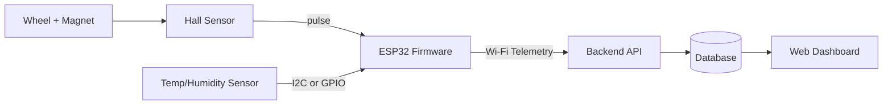
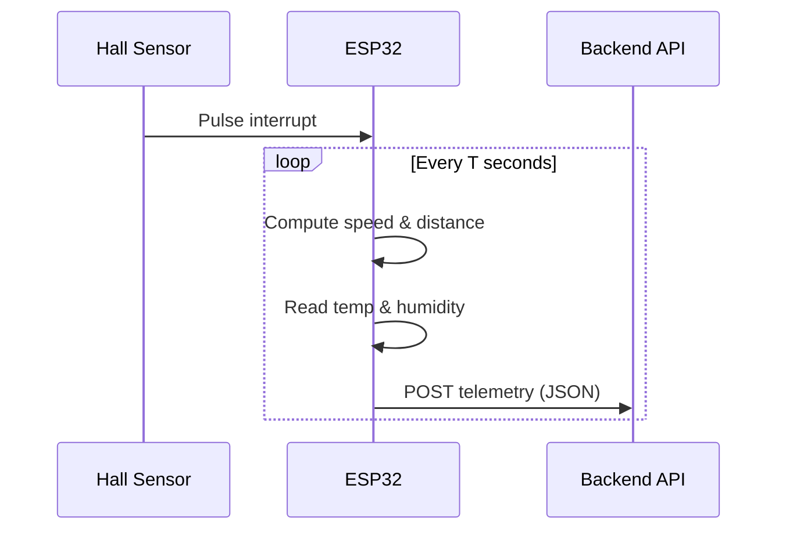
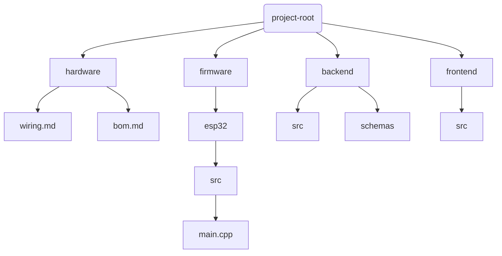

# Hamster Wheel Telemetry System

Full-Stack IoT: ESP32 + Hall Effect Sensor + Temperature/Humidity Monitoring

This repository contains a **full-stack hardware + software** project for measuring a hamster wheel’s **distance** and **speed**, while also monitoring **environmental temperature and humidity** near the wheel/cage area.

The system uses an **ESP32** to read:

- **Wheel rotation pulses** from a Hall effect sensor (magnet passes the sensor once per revolution)
- **Temperature/Humidity** from an environmental sensor (e.g., DHT22 or SHT31)

The ESP32 sends telemetry over Wi-Fi to a backend API. The backend stores data in a database, and a web frontend visualizes both **real-time status** and **historical trends**.

---

## Table of Contents

- [Hamster Wheel Telemetry System](#hamster-wheel-telemetry-system)
  - [Table of Contents](#table-of-contents)
  - [1. Why this project](#1-why-this-project)
  - [2. What the system measures](#2-what-the-system-measures)
    - [2.1 Wheel telemetry](#21-wheel-telemetry)
    - [2.2 Environment telemetry](#22-environment-telemetry)
  - [3. System architecture](#3-system-architecture)
    - [3.1 High-level architecture diagram](#31-high-level-architecture-diagram)
    - [3.2 Data flow](#32-data-flow)
  - [4. Hardware](#4-hardware)
    - [4.1 Overview](#41-overview)
    - [4.2 Components](#42-components)
    - [4.3 Hardware Design Considerations](#43-hardware-design-considerations)
  - [5. Firmware (ESP32)](#5-firmware-esp32)
    - [5.1 Responsibilities](#51-responsibilities)
    - [5.2 Timing model](#52-timing-model)
    - [5.3 Design choice](#53-design-choice)
  - [6. Calculations (Speed / Distance)](#6-calculations-speed--distance)
    - [6.1 Definitions](#61-definitions)
    - [6.2 Wheel Revolutions](#62-wheel-revolutions)
    - [6.3 Speed Calculation](#63-speed-calculation)
    - [6.4 Distance Calculation](#64-distance-calculation)
    - [6.5 Example Calculation](#65-example-calculation)
    - [6.6 Notes on Accuracy and Stability](#66-notes-on-accuracy-and-stability)
    - [6.7 Design Rationale](#67-design-rationale)
  - [7. Data Model](#7-data-model)
    - [7.1 Overview](#71-overview)
    - [7.2 Device Entity](#72-device-entity)
      - [Key Fields](#key-fields)
    - [7.3 Telemetry Entity](#73-telemetry-entity)
    - [7.4 Telemetry Structure](#74-telemetry-structure)
      - [7.4.1 Identification](#741-identification)
      - [7.4.2 Wheel Metrics](#742-wheel-metrics)
      - [7.4.3 Environmental Metrics](#743-environmental-metrics)
      - [7.4.4 Device \& Network Metadata](#744-device--network-metadata)
    - [7.5 Time-Series Characteristics](#75-time-series-characteristics)
    - [7.6 Data Ownership and Responsibility](#76-data-ownership-and-responsibility)
    - [7.7 Design Rationale](#77-design-rationale)
  - [8. API (Backend)](#8-api-backend)
    - [8.1 Purpose and Responsibilities](#81-purpose-and-responsibilities)
    - [8.2 API Design Principles](#82-api-design-principles)
    - [8.3 Base URL](#83-base-url)
    - [8.4 Authentication (Future)](#84-authentication-future)
    - [8.5 Endpoints Overview](#85-endpoints-overview)
    - [8.6 POST `/telemetry`](#86-post-telemetry)
      - [Request Headers](#request-headers)
      - [POST Request Body (Example)](#post-request-body-example)
    - [8.7 GET `/telemetry/latest`](#87-get-telemetrylatest)
      - [GET Query Parameters](#get-query-parameters)
      - [GET Example Request](#get-example-request)
      - [GET Response (Example)](#get-response-example)
    - [8.8 GET `/telemetry`](#88-get-telemetry)
      - [Query Parameter](#query-parameter)
      - [Example Request](#example-request)
      - [Response(Example)](#responseexample)
  - [8.9 GET `/health`](#89-get-health)
    - [Response](#response)
  - [8.10 Error Handling](#810-error-handling)
  - [8.11 Design Rationale](#811-design-rationale)
  - [9. JSON Schema](#9-json-schema)
    - [9.1 Purpose of Schema Validation](#91-purpose-of-schema-validation)
    - [9.2 Core Schema Fields](#92-core-schema-fields)
    - [9.3 Schema Strategy](#93-schema-strategy)
  - [10. Frontend Dashboard](#10-frontend-dashboard)
    - [10.1 Real-Time Monitoring](#101-real-time-monitoring)
    - [10.2 Historical Analysis](#102-historical-analysis)
    - [10.3 Design Goals](#103-design-goals)
  - [11. Repository Structure (Proposed)](#11-repository-structure-proposed)
  - [12. Future Enhancements](#12-future-enhancements)
  - [13. Status](#13-status)
  - [14. License](#14-license)

---

## 1. Why this project

Hamster wheels provide exercise, but it is difficult to quantify activity without instrumentation.  
This project aims to provide an **objective measurement** of:

- how far the wheel has spun (distance),
- how fast the hamster is running (speed),
- and how the environment (temperature/humidity) might correlate with activity.

In addition to being a practical tool, it is designed as a **portfolio-grade full-stack IoT project**, demonstrating:

- embedded development (ESP32),
- sensor integration,
- reliable data transmission,
- backend API + database design,
- and frontend visualization.

---

## 2. What the system measures

### 2.1 Wheel telemetry

- **Pulse Count**: number of Hall sensor triggers in a time window
- **Revolutions**: pulse count converted to wheel revolutions
- **Speed**: instantaneous linear speed based on wheel circumference
- **Distance**: per-interval distance and accumulated total distance

### 2.2 Environment telemetry

- **Temperature (°C)**
- **Humidity (%RH)**

> Environmental data is useful for observing whether activity patterns change with cage conditions.

---

## 3. System architecture

### 3.1 High-level architecture diagram



### 3.2 Data flow

1. **Wheel rotation detection**
   - A magnet attached to the wheel passes the Hall effect sensor once per revolution.
   - Each pass generates a digital pulse.

2. **Pulse capture on ESP32**
   - The ESP32 captures pulses using hardware interrupts to ensure accurate counting.
   - Noise and bounce are filtered by ignoring pulses below a minimum time threshold.

3. **Periodic computation**
   - At a fixed time interval (e.g., every 1 second), the ESP32:
     - Calculates revolutions, speed, and distance
     - Reads temperature and humidity from the environmental sensor

4. **Telemetry transmission**
   - The ESP32 packages all measurements into a JSON payload.
   - Telemetry is sent to the backend API via Wi-Fi using HTTP POST.

5. **Backend processing**
   - The backend validates incoming telemetry against a JSON schema.
   - Valid data is stored in a time-series database.

6. **Frontend visualization**
   - The frontend dashboard queries the backend for:
     - Latest telemetry (real-time view)
     - Historical telemetry (charts and trends)
   - Data is rendered as graphs and summary metrics for the user.

---

## 4. Hardware

### 4.1 Overview

The hardware subsystem is designed to be **simple, reliable, and extensible**.  
It focuses on accurate wheel rotation detection and stable environmental sensing while keeping component count low.

### 4.2 Components

- **ESP32 Development Board**
  - Main controller
  - Handles sensor input, computation, and Wi-Fi communication

- **Hall Effect Sensor + Magnet**
  - Detects wheel rotation
  - One magnet pass generates one digital pulse
  - Typically configured as **1 pulse per revolution (PPR = 1)**

- **Temperature / Humidity Sensor**
  - **DHT22**: simple, suitable for prototypes
  - **SHT31 / SHT35**: I2C-based, higher accuracy and stability (recommended)

- **Power Supply**
  - USB 5V during development
  - Battery-powered operation planned for future versions

### 4.3 Hardware Design Considerations

- Maintain a consistent distance between magnet and Hall sensor
- Secure magnet firmly to avoid misalignment
- Minimize vibration to prevent false triggering
- Place temperature/humidity sensor away from direct airflow or heat sources

---

## 5. Firmware (ESP32)

### 5.1 Responsibilities

- **Capture Hall sensor pulses using interrupts**
- **Debounce / noise filtering**
- ***Periodic calculation of:***
  - speed
  - distance
- **Read temperature & humidity**
- **Send telemetry as JSON to backend**
- **Handle Wi-Fi reconnection**

### 5.2 Timing model



### 5.3 Design choice

- **The ESP32 computes speed and distance locally before transmission:**
  - Reduces backend processing
  - Enables responsive real-time dashboard
  - Suitable for low-latency IoT telemetry
  
---

## 6. Calculations (Speed / Distance)

This section explains how raw wheel rotation pulses detected by the Hall effect sensor are converted into **speed** and **distance** values.

### 6.1 Definitions

| Symbol | Description | Unit |
| :----: | :---------- | :--: |
| $N$ | Number of pulses detected in a time window | *pulses* |
| $T$ | Time window duration | *seconds* |
| $PPR$ | Pulses per revolution (number of magnets on wheel) | *pulses / revolution* |
| $r$ | Wheel radius | *meters* |
| $C$ | Wheel circumference | *meters* |

Wheel circumference is defined as:

$$
C = 2\pi r
$$

### 6.2 Wheel Revolutions

The number of wheel revolutions during a given time window is calculated as:

$$
\text{revs} = \frac{N}{PPR}
$$

Where:

- $N$ is the number of detected pulses
- $PPR$ is typically $1$ when using a single magnet

### 6.3 Speed Calculation

**Revolutions per second (RPS):**

$$
\text{rps} = \frac{\text{revs}}{T}
$$

**Revolutions per minute (RPM):**

$$
\text{rpm} = \text{rps} \times 60
$$

**Linear speed (meters per second):**

$$
v_{\text{m/s}} = \text{rps} \times C
$$

**Linear speed (kilometers per hour):**

$$
v_{\text{km/h}} = v_{\text{m/s}} \times 3.6
$$

### 6.4 Distance Calculation

**Distance traveled during a single time window:**

$$
\Delta d = \text{revs} \times C
$$

**Total accumulated distance:**

$$
d_{\text{total}} = \sum \Delta d
$$

The total distance is calculated by accumulating distance increments over successive time windows.

### 6.5 Example Calculation

Assume:

- Pulses per revolution: $PPR = 1$
- Wheel circumference: $C = 1.0\,\text{m}$
- Pulse count during window: $N = 2$
- Time window duration: $T = 1\,\text{s}$

Step-by-step calculation:

$$
\text{revs} = \frac{2}{1} = 2
$$

$$
\text{rps} = \frac{2}{1} = 2
$$

$$
\text{rpm} = 2 \times 60 = 120
$$

$$
v_{\text{m/s}} = 2 \times 1.0 = 2.0\,\text{m/s}
$$

$$
v_{\text{km/h}} = 2.0 \times 3.6 = 7.2\,\text{km/h}
$$

$$
\Delta d = 2 \times 1.0 = 2.0\,\text{m}
$$

### 6.6 Notes on Accuracy and Stability

- Smaller time windows ($T$) provide faster response but may introduce noise
- Larger time windows smooth values but reduce responsiveness
- Mechanical vibration may cause false pulses; debounce filtering is recommended
- Accurate measurement of wheel radius ($r$) is critical for correct distance calculation
- Speed values can be smoothed using a moving average or exponential moving average (EMA)

### 6.7 Design Rationale

This calculation approach was chosen because:

- It requires minimal hardware (single Hall sensor and magnet)
- Computational load is low and suitable for ESP32-class devices
- Accuracy is sufficient for small-animal activity monitoring
- The model is transparent, verifiable, and easy to extend

---

## 7. Data Model

This section describes the **data model** used by the system, focusing on how devices
and telemetry data are represented, stored, and consumed across the firmware,
backend, and frontend layers.

The data model is designed to be **simple, explicit, and time-series oriented**, making
it suitable for long-term storage, analytics, and visualization.

### 7.1 Overview

The system data model consists of two primary entities:

1. **Device** – represents a physical ESP32 unit installed on a hamster wheel
2. **Telemetry** – represents time-series measurement data produced by a device

The relationship between these entities is:

- One **Device** produces many **Telemetry** records over time

### 7.2 Device Entity

The **Device** entity represents a single ESP32-based measurement unit.

Purpose:

- Uniquely identify the source of telemetry data
- Track firmware and configuration differences between devices
- Enable multi-device support in the future

#### Key Fields

| Field | Description |
| :----: | :---------- |
| `deviceId` | Unique identifier assigned to the ESP32 |
| `firmwareVersion` | Firmware version running on the device |
| `registeredAt` | Timestamp when the device was first registered |
| `lastSeenAt` | Timestamp of the most recent telemetry received |

The `deviceId` is included in every telemetry payload to associate measurements with
their originating device.

### 7.3 Telemetry Entity

The **Telemetry** entity represents a single time-stamped measurement snapshot.

Each telemetry record corresponds to data collected during a fixed time window
(e.g., every 1 second).

Purpose:

- Store wheel activity metrics
- Store environmental measurements
- Provide time-series data for analytics and visualization

### 7.4 Telemetry Structure

A telemetry record contains the following logical groups of fields.

#### 7.4.1 Identification

| Field | Description |
| :---: | :---------- |
| `deviceId` | Identifier of the source device |
| `timestamp` | [ISO 8601](https://www.iso.org/iso-8601-date-and-time-format.html) timestamp when the measurement was taken |

#### 7.4.2 Wheel Metrics

| Field | Description | Unit |
| :-----: | :---------- | :----: |
| `pulseCount` | Pulses detected in the time window | pulses |
| `windowSec` | Duration of the measurement window | seconds |
| `pulsesPerRev` | Pulses per wheel revolution | pulses / rev |
| `wheelCircumferenceM` | Wheel circumference | meters |
| `rpm` | Rotational speed | RPM |
| `speedMps` | Linear speed | m/s |
| `speedKmh` | Linear speed | km/h |
| `distanceDeltaM` | Distance traveled in this window | meters |
| `distanceTotalM` | Total accumulated distance | meters |

#### 7.4.3 Environmental Metrics

| Field | Description | Unit |
| :---: | :---------- | ---- |
| `temperatureC` | Ambient temperature | °C |
| `humidityRh` | Relative humidity | %RH |

#### 7.4.4 Device & Network Metadata

| Field | Description |
| :---: | :---------- |
| `rssi` | Wi-Fi signal strength |
| `batteryV` | Battery voltage (if battery-powered) |
| `firmwareVersion` | Firmware version of the device |

### 7.5 Time-Series Characteristics

Telemetry data is treated as **append-only time-series data**:

- Each record is immutable once stored
- Records are ordered by `timestamp`
- Queries are typically range-based (time window queries)

This design enables:

- Efficient historical queries
- Charting and trend analysis
- Aggregation over arbitrary time ranges

### 7.6 Data Ownership and Responsibility

| Layer | Responsibility |
| :---- | :------------- |
| Firmware (ESP32) | Generate and send telemetry data |
| Backend API | Validate, normalize, and persist data |
| Database | Store telemetry as time-series records |
| Frontend | Consume and visualize data |

### 7.7 Design Rationale

The data model was designed with the following goals:

- **Clarity**: Field names are explicit and self-describing
- **Extensibility**: New metrics can be added without breaking existing data
- **Consistency**: Same data structure used across firmware, backend, and frontend
- **Scalability**: Supports long-term data collection and multi-device expansion

This approach ensures that the system remains maintainable as new features and sensors
are introduced.

---

## 8. API (Backend)

This section describes the **backend API** responsible for ingesting telemetry data
from ESP32 devices, validating incoming payloads, storing them as time-series data,
and serving data to frontend clients.

The API functions as the **central integration layer** between firmware, database,
and frontend visualization.

### 8.1 Purpose and Responsibilities

The backend API is responsible for:

- Receiving telemetry data from ESP32 devices
- Validating payloads using JSON Schema
- Persisting telemetry as time-series data
- Serving real-time and historical data to frontend applications
- Acting as a single source of truth for the system

### 8.2 API Design Principles

- **Stateless**: Each request contains all necessary context
- **Schema-driven**: Strict validation of incoming telemetry
- **Time-series oriented**: Optimized for append-only telemetry data
- **Extensible**: New fields and sensors can be added without breaking compatibility

### 8.3 Base URL

All API endpoints are versioned and prefixed with:

[/api/v1](/api/v1)

Versioning allows backward compatibility as the API evolves.

### 8.4 Authentication (Future)

Authentication is optional during early development but planned for future versions.

Possible approaches include:

- API key per device
- Token-based authentication after device registration

Example header (future):

```html
X-API-Key: <device-api-key>
```

### 8.5 Endpoints Overview

| Method | Endpoint | Description |
| :------ | :--------: | :---------- |
| `POST` | `/telemetry` | Ingest telemetry data from ESP32 |
| `GET` | `/telemetry/latest` | Retrieve latest telemetry for a device |
| `GET` | `/telemetry` | Query historical telemetry data |
| `GET` | `/health` | Backend health check |

### 8.6 POST `/telemetry`

Ingests telemetry data sent from an ESP32 device.

#### Request Headers

```html
Content-Type: application/json
```

#### POST Request Body (Example)

```json
{
  "deviceId": "esp32-hamster-001",
  "timestamp": "2025-12-28T07:00:00.123Z",
  "pulseCount": 12,
  "windowSec": 1.0,
  "pulsesPerRev": 1,
  "wheelCircumferenceM": 1.005,
  "rpm": 720.0,
  "speedMps": 12.06,
  "speedKmh": 43.42,
  "distanceDeltaM": 12.06,
  "distanceTotalM": 345.12,
  "temperatureC": 24.6,
  "humidityRh": 48.2,
  "rssi": -61,
  "firmwareVersion": "0.1.0"
}
```

Processing Flow:

1. Validate payload against JSON Schema
2. Normalize and sanitize fields if necessary
3. Persist telemetry as a time-series record

Responses:

- `201` Created – Telemetry stored successfully
- `400` Bad Request – Schema validation failed
- `401` Unauthorized – Authentication failed (future)
- `500` Internal Server Error – Unexpected server error

### 8.7 GET `/telemetry/latest`

Returns the most recent telemetry record for a given device.

#### GET Query Parameters

|Parameter|Description|
|:-------:|:----------|
|`deviceId`|Target device identifier|

#### GET Example Request

```html
/telemetry/latest?deviceId=esp32-hamster-001
```

#### GET Response (Example)

```json
{
  "deviceId": "esp32-hamster-001",
  "timestamp": "2025-12-28T07:00:00.123Z",
  "speedKmh": 11.2,
  "distanceTotalM": 345.12,
  "temperatureC": 24.6,
  "humidityRh": 48.2,
  "rssi": -61
}
```

### 8.8 GET `/telemetry`

Retrieves historical telemetry records within a specified time range.

#### Query Parameter

| Parameter | Description |
| :-------: | :---------- |
| `deviceId` | Target device identifier |
| `from` | Start timestamp ([ISO 8601](https://www.iso.org/iso-8601-date-and-time-format.html)) |
| `to` | End timestamp ([ISO 8601](https://www.iso.org/iso-8601-date-and-time-format.html)) |
| `limit` | Maximum number of records |

#### Example Request

```html
/telemetry?deviceId=esp32-hamster-001&from=2025-12-28T00:00:00Z&to=2025-12-28T23:59:59Z
```

#### Response(Example)

```json
{
  "deviceId": "esp32-hamster-001",
  "from": "2025-12-28T00:00:00Z",
  "to": "2025-12-28T23:59:59Z",
  "items": [
    {
      "timestamp": "2025-12-28T07:00:00Z",
      "speedKmh": 10.2,
      "distanceTotalM": 120.5,
      "temperatureC": 24.4,
      "humidityRh": 48.0
    },
    {
      "timestamp": "2025-12-28T07:00:01Z",
      "speedKmh": 11.0,
      "distanceTotalM": 121.1,
      "temperatureC": 24.5,
      "humidityRh": 48.1
    }
  ]
}
```

## 8.9 GET `/health`

Provides a simple health check endpoint.

### Response

```json
{
  "status": "ok"
}
```

## 8.10 Error Handling

The API uses standard HTTP status codes to communicate request results.

| Status Code | Description |
| :---------: | :---------- |
| `200` | Request succeeded |
| `201` | Resource created |
| `400` | Invalid request or schema validation failure |
| `401` | Unauthorized |
| `404` | Resource not found |
| `500` | Internal server error |

## 8.11 Design Rationale

The backend API design emphasizes:

- Clear separation between firmware and frontend
- Strong data validation to prevent corrupted telemetry
- Scalability for long-term time-series data storage
- Extensibility for future sensors and analytics

---

## 9. JSON Schema

Telemetry payloads are validated using **JSON Schema** to ensure data consistency,
type safety, and long-term maintainability across firmware, backend, and frontend.

### 9.1 Purpose of Schema Validation

JSON Schema is used to:

- Enforce correct data types and required fields
- Reject malformed or incomplete telemetry payloads
- Maintain database integrity
- Enable predictable API behavior

### 9.2 Core Schema Fields

| Field | Type | Description |
| :---: | :--: | :---------- |
| `deviceId` | string | Unique identifier of the ESP32 device |
| `timestamp` | string | [ISO 8601](https://www.iso.org/iso-8601-date-and-time-format.html) timestamp |
| `pulseCount` | integer | Number of pulses in the time window |
| `windowSec` | number | Duration of measurement window (seconds) |
| `speedKmh` | number | Linear speed (km/h) |
| `distanceTotalM` | number | Total accumulated distance (meters) |
| `temperatureC` | number | Ambient temperature (°C) |
| `humidityRh` | number | Relative humidity (%RH) |

### 9.3 Schema Strategy

- Core fields are required for all telemetry records
- Optional fields allow backward-compatible extension
- Schema evolution is versioned alongside the API

---

## 10. Frontend Dashboard

The frontend dashboard provides a **visual interface** for monitoring wheel activity
and environmental conditions in both real time and over historical periods.

### 10.1 Real-Time Monitoring

The real-time view displays:

- Current wheel speed
- Total accumulated distance
- Temperature
- Humidity
- Last update timestamp and connection status

### 10.2 Historical Analysis

Historical views include:

- Speed vs time charts
- Distance accumulation over time
- Temperature and humidity trends

These views allow users to analyze behavior patterns over longer durations.

### 10.3 Design Goals

- Clear and readable UI
- Responsive layout for desktop and mobile
- Read-only visualization focused on monitoring and analysis

---

## 11. Repository Structure (Proposed)

The repository is organized by responsibility to keep hardware, firmware, backend,
and frontend concerns clearly separated.

```text
.
├── hardware/
│   ├── wiring.md
│   └── bom.md
├── firmware/
│   └── esp32/
│       └── src/
│           └── main.cpp
├── backend/
│   ├── src/
│   └── schemas/
└── frontend/
    └── src/
```



---

## 12. Future Enhancements

Planned future extensions include:

- Automatic activity session detection (start/stop)
- Alerts for high temperature or humidity
- Progressive Web App (PWA) support
- Multi-device and multi-user support
- Data export (CSV / JSON)
- Advanced analytics and activity pattern analysis

## 13. Status

Future Project / In Development

This project currently focuses on system architecture, data modeling, and interface definitions. Incremental implementation and testing are planned in future phases.

## 14. License

Copyright © 2025 Saranchana Chanpongsang

This project is licensed under the [MIT License](LICENSE).
